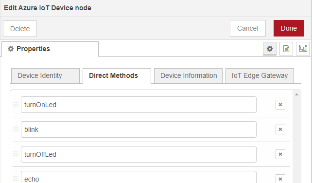
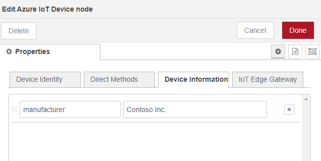
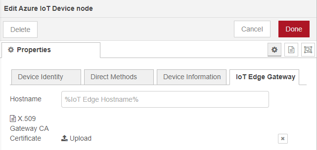

# Configure the Azure IoT Device Node
In this document we describe how to configure the Node-RED Azure IoT Device node for first use.

## Good to know
The Azure IoT Device Node-RED node can be configured as an Azure IoT Device using multiple attestation methods and provisioning. In this document we will not explain the details of Azure IoT provisioning, attestation methods, and using X.509 certificates, but we will explain what you need to use as node settings to enable them.

>For more information on the subjects above read:
>* Manual provisioning with [Azure IoT Hub](https://docs.microsoft.com/en-us/azure/iot-hub/).
>    * Using the Azure Portal, Azure CLI, Visual Studio Code, Powershell or the Azure IoT Services SDK.
>* Automated provisioning using [Azure IoT Device Provisioning Services](https://docs.microsoft.com/en-us/azure/iot-dps/).
>* [Device Authentication using X.509 CA Certificates](https://docs.microsoft.com/en-us/azure/iot-hub/iot-hub-x509ca-overview).

The Azure IoT Device node can either use a symmetric key or a X.509 certificate as the attestation mechanism. More information on using symmetric key or X.509 certificates can be found in the Azure IoT Hub and Device Provisioning Services documentation online.

## Create and configure an Azure IoT Device Node-RED node
Once you installed Node-RED and the Azure IoT Device Node-RED node, run Node-RED and browse to the Node-RED website on your machine, f.i. &lt;node-red-machine&gt;:1880.
In the nodes section on the left-hand side, scroll down to the bottom where you will find the Azure IoT Device node: 

### Steps to configure the node
Like any other Node-RED node you can create an instance of this node by dragging it onto a flow. Once you've dragged it into the flow you have to configure the node as a specific Azure IoT device. In this section we will explain the different setting-tabs and how you can use them to define the behavior of the Azure IoT device.

### Device Identity
You need to use the Device Identity tab to define the device identity and the way it connects to Azure IoT. Depending on the choices you make in the drop-down boxes you will see additional fields and options.

##### Fields and options
The following table contains explanation of the fields and options on the **Device Indentity** tab. Some fileds will only be visible depending on selection choices made in other fields.
| Field/option | Description | Depends on |
| --- | --- | --- |
| Device ID | This field will contain the device ID of the Azure IoT device as it is/will be on IoT Hub or IoT Central. | - |
| Connection Type | This option indicates whether the device will use a preset connection string or use [Device Provisioning Service](https://docs.microsoft.com/en-us/azure/iot-dps/). Depending on the option you select different fields will be shown to fill. | - |
| Authentication Method | Azure IoT supports two authentication types, SAS token-based authentication and X.509 certificate authentication (individual and CA based). | - |
| IoT Hub Hostname | The [Azure IoT Hub](https://docs.microsoft.com/en-us/azure/iot-hub/) Hostname '%iothubname%.azure-device.net'. The name can be found in the Azure portal on the overview page of the IoT Hub. | Connection Type |
| IoT Central Device | Option to indicate whether the device is an [Azure IoT Central](https://docs.microsoft.com/en-us/azure/iot-central/) device.  | Connection Type |
| Scope ID | The device provisioning Scope ID. This ID identifies the specific Azure Device Provisioning service to use. Azure IoT Central devices can only be provisioned using Device Provisioning. | Connection Type |
| Enrollment type | Selection to indicate whether the device provisioning enrollment is an individual or a group enrollment. | Connection Type |
| Authentication Method | Selection to indecate whther the attestation method used is shared access key (SAS) or certificate (X.509). | - |
| SAS Key | The [symmetric key](https://docs.microsoft.com/en-us/azure/iot-dps/concepts-symmetric-key-attestation) to authenticate with the Device Provisioning Service (DPS) instance or Azure IOT Central. | Authentication Method |
| X.509 Certificate | The [X.509](https://docs.microsoft.com/en-us/azure/iot-hub/iot-hub-x509ca-overview) certifate, containing the full chain of the certificate tree for the IoT device. The certificate can be uploaded. | Authentication Method |
| X.509 Key | The Azure IoT device X.509 key. The key can be uploaded. | Authentication Method |
| Protocol | The Azure IoT platform supports three communication [protocols](https://docs.microsoft.com/en-us/azure/iot-hub/iot-hub-devguide-protocols): HTTPS, MQTT and AMQP. AMQP and MQTT can also be used over websockets. For this node you can only select the MQTT and AMQP, because these protocols support direct communicaton between device and cloud. If you need to use the 443 port outbound from the device, you can use the websockets options. | - |

### Direct Methods
The [Direct Methods](https://docs.microsoft.com/en-us/azure/iot-hub/iot-hub-devguide-direct-methods) tab is used to indicate which methods are supported by the Azure IoT Device node. This will also require to create processing flows fror each method supported. This tab contain a table where direct methods can be added or deleted. 

Direct methods can be used from the cloud side to trigger an activity on the device, which requires a request-response pattern.

##### Fields and options
Direct Methods items can be added or deleted in this tab. Each item will require:
- Direct Method name

### Device Information
The **Device Information** tab enables you to set initial reported properties for a device. [Azure Plug and Play](https://docs.microsoft.com/en-us/azure/iot-pnp/) enables you to provide information on the device that is connected. 

##### Fields
Device Information items can be added or deleted in this tab. Each item will require:
- Item name
- Item content. This content can be a single value or a JSON formated string.

### Iot Edge Gateway
The **Iot Edge Gateway** tab enables you to setup your device as a downstream devcie to an IoT Edge device. More information on how to setup an [IoT Edge as a transparant gateway](https://docs.microsoft.com/en-us/azure/iot-edge/how-to-create-transparent-gateway) and use a device as a [downstream device](https://docs.microsoft.com/en-us/azure/iot-edge/how-to-authenticate-downstream-device). All code to enable the downstream device is already implemented in the node. The node just needs to right hostname and certificate to enable to connection between the device and the IoT Edge.

##### Fields
The following table contains explanation of the fields and options on the **IoT Edge Gateway** tab.
| Field | Description |
| --- | --- | --- |
| Hostname | This field will contain the IoT Edge hostname. The hostname identifies a specific IoT Edge. |
| X.509 Gateway CA Certificate | The IoT Edge X.509 CA certificate. This certificate will be used to enable encrypted and trusted communication between the device and the IoT Edge. The certificate can be uploaded. |

## Finalize
Once you've configured the device, you need to deploy the node in Node-RED. If the setup was correct, the device will connect to the Azure IoT platform. In the debug window you can see whether the configuration was correct and the device was able to provision and connect to the Azure IoT platform. How to use the node can be found [here](./USE.md).