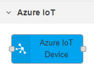
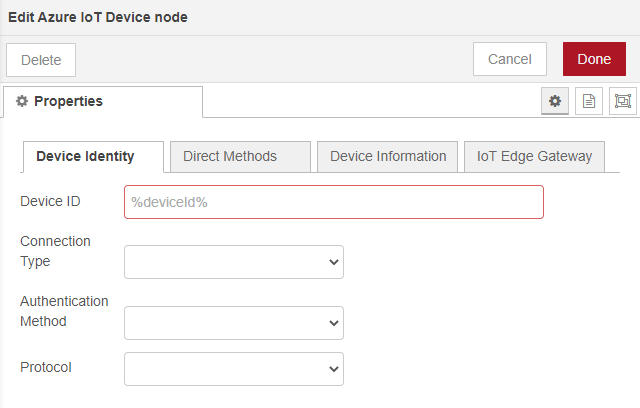

# Azure IoT Device Node-Red node
The Azure IoT Device Node-Red node is a node that can be used to connect Node Red to the Azure IoT platform. It can connect to Azure IoT Hub, Azure IoT Central, and use Azure IoT Edge as a transparant gateway. The node has been created to support the different attestation methodes (SAS, X.509) as well as use Azure Device Provisioing service. The node has been developed using the [Azure IoT Node.js SDK](https://github.com/Azure/azure-iot-sdk-node/).
The Azure IoT Device Node-Red node can be used to test your device setup using Node-Red. 

> DISCLAIMER: The Azure IoT Device Node-Red node is developed as is. Please be aware that use of this code and the node is at your own risk.

## Deploy the node to your Node-Red
The node can be manually deployed using the 'npm install &lt;folder&gt;' command. How to get started with Node-Red can be found here: https://nodered.org/docs/getting-started/.

Steps to install this node:

1. Stop Node-Red on your machine
2. Clone this repository to a local directory on your machine runing Node-Red: <code>git clone https://github.com/iotblackbelt/node-red-contrib-azure-iot-device.git</code>
3. In your node-red user directory, typically ~/.node-red, run:

    <code>npm install &lt;location of node module&gt;</code> 
    For example, on Mac OS or Linux, if the node is located at ~/my-nodes/node-red-contrib-azure-iot-device you would do the following:

    <code>cd ~/.node-red 
    npm install ~/my-nodes/node-red-contrib-azure-iot-device</code>

    On Windows you would do:

    <code>cd C:\Users\<user>\.node_red 
    npm install C:\Users\my_name\Documents\GitHub\node-red-contrib-azure-iot-device</code>

This creates a symbolic link to your node module project directory in ~/.node-red/node_modules so that Node-RED will discover the node when it starts. Any changes to the node’s file can be picked up by simply restarting Node-RED. On Windows, use npm 5.x or greater. 

>Note : npm will automatically add an entry for your module in the package.json file located in your user directory. If you don't want it to do this, use the --no-save option to the npm install command.

## Good to know
The Azure IoT Device Node-Red node can be setup as an Azure IoT Device using multiple attestation methods and provisioning. In this README I will not explain the details of the provisioning and attestation methods, but will explain what you need to use the node settings to enable them. 

>For more information on provsionig read:
>* Manual provisioning with [Azure IoT Hub](https://docs.microsoft.com/en-us/azure/iot-hub/)
>    * Using the Azure Portal, Azure CLI, Visual Studio Code, Powershell or the Azure IoT Services SDK.
>* Automated provisioning using [Azure IoT Device Provisioning Services](https://docs.microsoft.com/en-us/azure/iot-dps/)

The Azure IoT Device Node-Red node can either use a symmetric key or a X.509 certificate as the attestation mechanism. More information on using symmetric key or X.509 certificates can be found in the Azure IoT Hub and Device Provisioning Services documentation online.

## Create and setup an Azure IoT Device Node-Red node
Once you installed Node-Red and the Azure IoT Device Node-Red node, rund Node-Red and browse to the Node-Red website on your machine &lt;mnode-red-machine>:1880&gt;.
In the nodes section on the left-hand side, scroll down to the bottom where you will find the Azure IoT Device node: 

### Steps to setup the node
Like any other Node-Red node you can create an instance of this node by dragging it onto a flow. Once you've dragged it into the flow you have to setup the node as a specific Azure IoT device. In this section I will explain the different setting-tabs and how you can use them to define the behavior of the Azure IoT device.

#### Device Identity tab
You need to use the Device Identity tab to define the device and the way it connects to Azure IoT. Depeniding on the choices you make in the drop-down boxes you will see addtional fields and options.

##### Fields
* Device ID. Provide the ID of the device.If you use a predefined device in Azure IoT Hub or Azure IoT Central, you need to use the ID you created. If you use Azure Device Provisioning Services (for IoT Hub or IoT Central) you can use any device ID, This device Id will then be created in IoT Hub or IoT Central 
* Connection type:
    * Connection string: use when the device is already predefined in Azure IoT Hub.
    * Device provisioning service: use when you are using Azure Device Provisioing Service or the Azure IoT Central Provisioning service.

## Future plans for development
It is my intention to add the following features to the Azure IoT Device Node-Red node:
* Upload of X.509 certificate and key files using the node settings windows.
* [Azure IoT Plug and Play](https://docs.microsoft.com/en-us/azure/iot-pnp/overview-iot-plug-and-play) support.