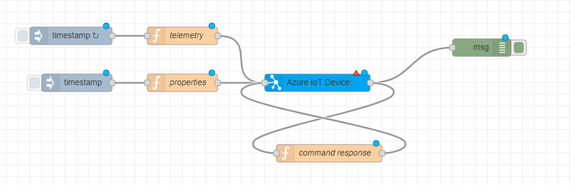

# Use the Azure IoT Device Node
In this document we describe how to use the Azure IoT Device node for D2C and C2D communication.

## Supported interactions
The Azure Device node can be used for:
- sending telemetry
- receiving and responding to commands
- receiving desired properties
- updating reported properties
- receiving C2D messages

Each interaction will be descrbide in detail in the next sections. The node has a single input and a single output. The node determines the actions to take, based on the topic of Node-RED message.

## Output topics
The following output topics are supported:
- 'provisioning' - the outcome of the provisioning process
- 'property' - desired properties received
- 'command' - a received direct method
- 'message' - a received C2D message

### Output provisioning message
When the node is deployed using Device Provisioning a node message in the following format will be received on the output, when the provisioning is successful:

```
{
    'topic':'provisioning',
    'deviceId':'<device_id>',
    'payload': {
        'registrationId':'<device_id>',
        'createdDateTimeUtc':'UTC_timestamp>',
        'assignedHub':'<iot_hub_name>.azure-devices.net',
        'deviceId':'<device_id>',
        'status':'<provisioning_status>',
        'substatus':'<provisioning_substatus>',
        'lastUpdatedDateTimeUtc':'<UTC_tinestamp>',
        'etag':'<etag>',
        'payload': { <custom_provisioning_payload> } /* optional */
    }
}
```

You can use this provisioning message to do some additional processing on the device side. If you use [custom allocation policies](https://docs.microsoft.com/en-us/azure/iot-dps/how-to-use-custom-allocation-policies) you can return a [payload to the device](https://docs.microsoft.com/en-us/azure/iot-dps/how-to-send-additional-data) that can be used for processing.

### Output property message
When you update the desired properties on a device twin in Azure, the node will send a node message to the output containing the updated desired properties:

```
{
    'topic':'property',
    'deviceId':'device_id',
    'payload': {
        '<property>': <value>,
        ...
        '$version': <version_number>
    }
}
```

You can use this message to do additional processing on the device.

### Output command message
When you send a direct method to the device from Azure, the node will send a node message to the output containing the command and its parameters:

```
{
    'topic':'command',
    'deviceId':'device_id',
    'requestId': '<request_id>',
    'methodName': '<method_name>',
    'payload': {
        '<paramter>': <value>,
        ...
    }
}
```

You can use this message to do additional processing on the device. The Azure IoT Platform requires a response on a direct method. To send this response you can use the [Input a command response](./USE.md#input-a-command-response) approach. Make sure you use the same request_id, to ensure command and response correlation.

### Output C2D message
When you send a C2D message to the device from Azure, the node will send a node message to the output containing the message and its parameters:

```
{
    "topic":"message",
    "deviceId":"node-red-21",
    "messageId":"",
    "data":"<message_data>",
    "properties": {
        "propertyList":
            [<property_array>]
    }
}
```

You can use this message to do additional processing on the device. A message doesn't require a response to be send back.

## Input topics
The following input topics are supported:
- 'telemetry' - telemetry to be send
- 'property' - properties to report
- 'response' - a response to a received direct method


### Input telemetry
Sending telemetry requires you to create a connection to the node input and send a node message in the following format:

```
{
    'topic': 'telemetry',
    'payload': { 
        '<name>': '<value>',
        ...
    }
}
```

### Input reported properties
Sending reported properties requires you to create a connection to the node input and send a node message in the following format:

```
{
    'topic': 'property',
    'payload': { 
        '<name>': <value>,
        ...
    }
}
```

If your device is an IoT Central device you should use the following format:
```
{
    'topic': 'telemetry',
    'payload': { 
        '<name>': {'value': <value>},
        ...
    }
}
```

### Input a command response
Sending a command response requires you to create a connection to the node input and send a node message in the following format:

```
{
    'topic': 'response',
    'requestId': '<request_id>',
    'methodName': '<method_name>',
    'status': <status_code>,
    'payload': { 
        '<name>': <value>,
        ...
    }
}
```

The request_id is provided by the received direct method, and will need to be returned to the Azure IoT platform to establish the connection between command and response.
The status property is the device-supplied status of method execution. 

## Example flow
Here is an example flow that implements all input topics and an automated response to a direct method. You only have to [configure](./CONFIGURE.md) your node to represent a device. Once you've configured the node and depolyed the flow, the telemetry will be send every 5 seconds and the reported properties can be send clicking the **Trigger reported properties**.



Paste the following code into the "Import nodes" dialog.
```json
[{"id":"454f7422.1eae2c","type":"azureiotdevice","z":"1c145919.b011a7","deviceid":"","connectiontype":"dps","authenticationmethod":"sas","iothub":"","isIotcentral":false,"scopeid":"","enrollmenttype":"group","saskey":"","certname":"","keyname":"","protocol":"mqtt","methods":[{"name":"turnOnLed"},{"name":"blink"},{"name":"turnOffLed"},{"name":"echo"},{"name":"countdown"}],"information":[{"name":"manufacturer","value":"Contoso Inc."}],"gatewayHostname":"","caname":"","x":670,"y":260,"wires":[["c91f52ec.5c28c","c215305f.aeabe"]]},{"id":"c91f52ec.5c28c","type":"debug","z":"1c145919.b011a7","name":"Debug output","active":true,"tosidebar":true,"console":false,"tostatus":false,"complete":"true","targetType":"full","x":920,"y":220,"wires":[]},{"id":"418e259c.7afc6c","type":"inject","z":"1c145919.b011a7","name":"Trigger telemetry","topic":"","payload":"","payloadType":"date","repeat":"5","crontab":"","once":true,"onceDelay":0.1,"x":210,"y":180,"wires":[["975dd04.c06673"]]},{"id":"975dd04.c06673","type":"function","z":"1c145919.b011a7","name":"telemetry","func":"msg = {\n    'topic': 'telemetry',\n    'payload': {'humidity': Math.round(10000*Math.random())/100,\n        'temperature': 20 + (Math.round(2500*Math.random())/100),\n        'pressure': 850 + (Math.round(35000*Math.random())/100)\n    }\n}\nreturn msg;","outputs":1,"noerr":0,"x":440,"y":180,"wires":[["454f7422.1eae2c"]]},{"id":"a3fdf5d6.685468","type":"inject","z":"1c145919.b011a7","name":"Trigger reported properties","topic":"","payload":"","payloadType":"date","repeat":"","crontab":"","once":false,"onceDelay":0.1,"x":190,"y":260,"wires":[["e0e8780f.52d7c8"]]},{"id":"e0e8780f.52d7c8","type":"function","z":"1c145919.b011a7","name":"properties","func":"msg = {\n    'topic': 'property',\n    'payload': { 'fanSpeed': {'value':120},\n        'voltage': {'value':5},\n        'current': {'value':55},\n        'irSwitch': {'value':true}\n    }\n}\nreturn msg;","outputs":1,"noerr":0,"x":440,"y":260,"wires":[["454f7422.1eae2c"]]},{"id":"c215305f.aeabe","type":"function","z":"1c145919.b011a7","name":"command response","func":"if (msg.topic == \"command\") {\n   var response = {\n       \"topic\": \"response\",\n       \"requestId\": msg.payload.requestId,\n       \"methodName\": msg.payload.methodName,\n       \"status\": 200,\n       \"payload\": msg.payload.payload\n   };\n   return response;\n}\n","outputs":1,"noerr":0,"x":690,"y":380,"wires":[["454f7422.1eae2c"]]}]
```